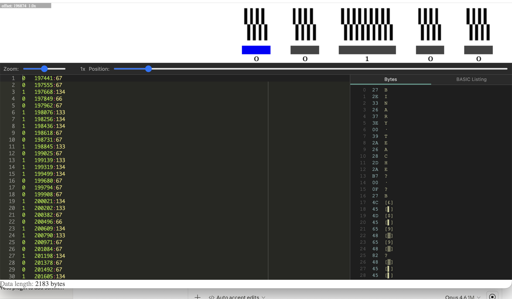

# ZX81 Tape Reader

A desktop app for decoding cassette tape recordings from Sinclair ZX81 and Timex/Sinclair 1000 computers. Analyzes WAV audio files using hysteresis-based half-period detection to recover the original program data, with a visual editor for manual correction of degraded signals.



## Features

- **Hysteresis-based decoding** using a Schmitt trigger approach to detect signal transitions, which is robust against sinusoidal waveforms, noise near zero crossings, and azimuth misalignment
- **Adaptive thresholds** that automatically calibrate to each recording's characteristics — no hardcoded frequencies or pulse widths
- **DC offset removal** via rolling window mean subtraction
- **Automatic signal detection** that finds where data starts without requiring a pilot tone
- **Visual waveform display** with zoom (Ctrl+scroll or slider) and pan (scroll or position slider) for inspecting the original audio
- **Interactive bit editor** where detected pulses are shown as 0s, 1s, or ?s for manual review and correction
- **Click-to-navigate** between waveform and editor: click a spot on the waveform to jump to the corresponding bit
- **ZX81 byte viewer** showing hex values and ZX81 character codes for decoded bytes
- **BASIC listing reconstruction** that parses decoded bytes as a ZX81 program with line numbers and expanded keyword tokens
- **Session save/load** (.ztr files) for working across multiple sessions
- **Export** to .tzx (tape image with headers for emulators) and .p (raw ZX81 program file)
- **Built-in user guide** with examples of fixing common tape degradation issues

## Installation

### From release binaries

Download the latest release for your platform from the [Releases](../../releases) page:
- **macOS**: DMG (ARM and Intel)
- **Windows**: Installer (.exe)
- **Linux**: AppImage

### From source

Requires [Node.js](https://nodejs.org/) 22 or later.

```bash
git clone https://github.com/factus10/ZX81-Tape-Reader.git
cd ZX81-Tape-Reader
npm install
npm start
```

## Usage

### 1. Open a WAV file

Use **File > Open WAV...** (Cmd+O / Ctrl+O) to load a tape recording. The tool will analyze the audio for bit patterns. This may take a few seconds depending on file size.

You can also pass a file on the command line:

```bash
npm start -- /path/to/recording.wav
```

### 2. Review and correct

The editor shows detected bits as text lines. Each line has a symbol, sample offset, and run length:

| Symbol | Meaning |
|--------|---------|
| `0` | Zero bit (larger pulse burst) |
| `1` | One bit (smaller pulse burst) |
| `?` | Unrecognized pulse; needs manual review |
| `-` | Noise or sync pulse, ignored |

Use **Cmd+F** to search for `?` marks and review them against the waveform. Lines marked with `# suspicious loss of signal?` indicate gaps where the signal may have degraded.

When inserting corrected bits, you only need to type the symbol (e.g. `0` or `1`). The offset and run length are inferred automatically.

The **Bytes** tab on the right panel shows the decoded byte values with ZX81 character codes. The **BASIC Listing** tab shows the reconstructed ZX81 BASIC program.

### 3. Save your work

Use **File > Save Session** (Cmd+S) to save progress as a .ztr session file that you can reopen later.

### 4. Export

- **File > Export as .tzx...** for use in ZX81 emulators
- **File > Export as .p...** for the raw ZX81 program file

Check the byte count in the status bar before exporting. A non-integer number of bytes usually indicates missing or extra bits.

## Keyboard shortcuts

| Shortcut | Action |
|----------|--------|
| Cmd+O | Open WAV file |
| Cmd+Shift+O | Open session |
| Cmd+S | Save session |
| Cmd+Shift+S | Save session as |
| Cmd+F | Find in editor |
| Cmd+Z / Cmd+Shift+Z | Undo / Redo |
| Ctrl+Scroll | Zoom waveform |
| Scroll | Pan waveform |
| F1 | User guide |

## How it works

The decoder uses a [Schmitt trigger](https://en.wikipedia.org/wiki/Schmitt_trigger) (hysteresis) approach instead of zero-crossing or amplitude detection:

1. **DC offset removal** — subtracts a rolling 100ms window mean to correct bias
2. **Hysteresis transition detection** — uses ±30% of peak amplitude as high/low thresholds, eliminating false transitions from noise near zero
3. **Half-period measurement** — measures the time between consecutive transitions
4. **Adaptive calibration** — builds a histogram of half-period lengths and finds the valley between the short-pulse (1-bit) and long-pulse (0-bit) clusters
5. **Burst grouping** — groups consecutive short half-periods into bursts, then classifies each burst by its half-period count to determine the bit value

This approach is significantly more robust than amplitude or zero-crossing detection on deteriorated tapes where the signal is sinusoidal (from azimuth misalignment or head rolloff), has no pilot tone, or has high noise near zero crossings.

## Building

To build a standalone app for your platform:

```bash
npm run dist          # macOS
npm run dist:win      # Windows
npm run dist:linux    # Linux
```

The built app will be in the `dist/` directory.

## Credits

Forked from [zx81-dat-tape-reader](https://github.com/mvindahl/zx81-dat-tape-reader) by [Martin Vindahl Olsen](https://github.com/mvindahl), who created the original tape decoding approach and interactive editor.

This fork by [David Anderson](https://github.com/factus10) replaces the decoder with a hysteresis-based approach for ZX81/TS1000 tapes, modernizes the app with Electron 41 and secure context isolation, and adds session save/load, ZX81 byte decoding, BASIC listing reconstruction, waveform zoom/pan, and standalone app packaging.

## License

[GPL-3.0](LICENSE)
